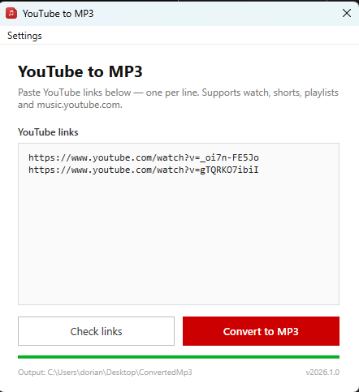

# Youtube To MP3 Converter

A simple WPF desktop app to download YouTube videos as MP3 files.
Paste one or more YouTube links, click **Check links**, then **Convert to MP3**. Files land in `Desktop\ConvertedMp3`.

> Built on .NET 8 WPF; no installation required, single `.exe` with everything bundled.

## Download

Head to the [Releases](https://github.com/DorianNaaji/Youtube-To-MP3-Converter/releases) page and download the latest `YoutubeToMP3.exe`.

> **Note:** The exe is large (~130 MB) because it bundles the .NET 8 runtime, yt-dlp, and ffmpeg; no external dependencies needed.

On first launch, yt-dlp and ffmpeg are extracted to `%TEMP%\YoutubeToMP3\`. This takes a few seconds only once.

## Usage

1. Paste YouTube links into the text box, one per line
2. Click **Check links** to validate them
3. Click **Convert to MP3** and wait for the progress bar to complete
4. Find your MP3 files in `Desktop\ConvertedMp3`

> Only standard watch links are supported: `https://www.youtube.com/watch?v=...` (& playlists links but better clean them before)

---

## How it works

The app shells out to [yt-dlp](https://github.com/yt-dlp/yt-dlp) with the following flags:

```
yt-dlp -x --audio-format mp3 --audio-quality 0 --ffmpeg-location <path> -o "Desktop/ConvertedMp3/%(title)s.%(ext)s" <url>
```

Both `yt-dlp.exe` and `ffmpeg.exe` are embedded inside the `.exe` and extracted automatically.

---

## Updating yt-dlp

If YouTube changes its API and downloads start failing, the fix is usually to update yt-dlp:

1. Download the latest `yt-dlp.exe` from [yt-dlp releases](https://github.com/yt-dlp/yt-dlp/releases)
2. Replace `YoutubeToMP3/lib/yt-dlp.exe` in this repo
3. Push and create a new GitHub Release — the pipeline builds and publishes a new exe automatically

Alternatively, use the **Run workflow** button in the Actions tab to re-attach the exe to an existing release without creating a new one.

## Build from source

Requirements: .NET 8 SDK, Windows (WPF is Windows-only)

```bash
dotnet publish YoutubeToMP3/YoutubeToMP3.csproj -c Release -r win-x64 --self-contained -p:PublishSingleFile=true -p:EnableCompressionInSingleFile=true -o ./publish
```

The pipeline (`.github/workflows/release.yml`) runs this automatically on every GitHub Release.

## UI



---

*Made by [Dorian NAAJI](https://github.com/DorianNaaji)*
